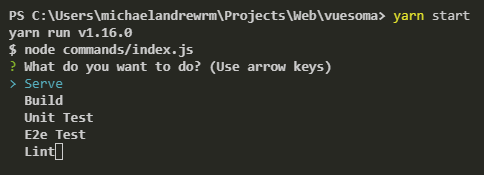
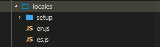
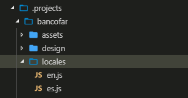
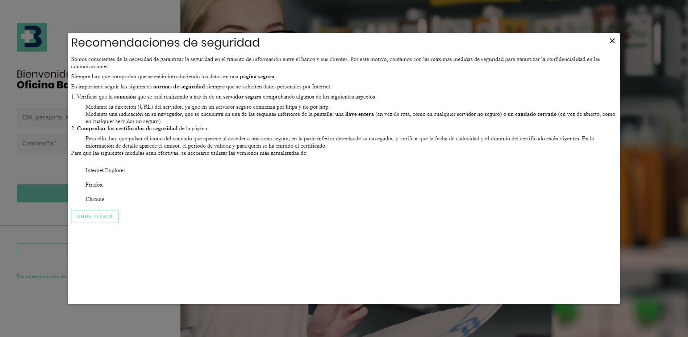

# **Directory Structure**

## **Directories**

### **The Projects Directory**
Actually exists two main projects, **Bancofar** and **Caminos** that are located in the `projects` directory.

### **The Commands Directory**
*Vuesoma* offers a helpful interface to execute different actions, e.g: `serve` a project, this will run a local server and show the selected project. This `command` directory includes a `index.js` file with all the commands.



### **The Docs Directory**
All project must be documented, the documentation for the *Vuesoma* project is located in the `docs` directory. The documentation is available in two language so far, in *English* as default language and *Spanish*. Learn [How to document?](/how-to-document)

### **The Assets Directory**
The `assets` directory includes reusable atoms as: *fonts*, *icons*, *images*, etc.

### **The Components Directory**
All the functional `Vue.js` components reused across the projects are located in the `components` directory.

### **The Design Directory**
Every *Vuesoma* project has a design directory where its default theme is created, the `design` directory contains an `index.scss` file that integrates those projects theme to the application.

### **The Layout Directory**
The `layout` directory includes the application layouts. Layouts are used to change the look of a page with some attached components by default (e.g. by including a sidebar).

### **The Locales Directory**
The `locales` directory provides a multi-language environment. By default, **Vuesoma** projects are in two languages, *Spanish* and *English*. All the literals used in each project must be registered on its locales directory to be integrated later on the root directory. Learn [How to create a literal?](/how-to-create-a-literal)

Root project locales: <br/>


Project locales: <br/>


### **The Modals Directory**
When any project requires a component to be shown as popup, the modal plugin comes into action and shows the related modal component. These components are located in the `modals` directory.

Example of a modal: <br/>


### **The Plugins Directory**
The `plugins` directory contains the functionalities used by the application and globally available for the rest of the `Vue.js` instances. `Modals` and `Bugsnag` are the current plugins available.

Example of the application using a plugin: <br/>
```js{3}
import Vue from 'vue';
import Notifications from 'vue-notification';
import Modal from './plugins/modal';
import App from './app.vue';
import router from './router';
import store from './store';
import i18n from './locales/setup';
import './registerServiceWorker';
import './plugins/bugsnag';
Vue.config.productionTip = false;

Vue.use(Notifications);
Vue.use(Modal); // Used here

new Vue({
	i18n,
	router,
	store,
	render: h => h(App)
}).$mount('#vuesoma');
```


### **The Providers Directory**
The `providers` directory offers functionalities that can be injected in the different components.

Example of the `notify` provider added to the root app and inject to a component: <br/>

```vue{10}
./App.vue

<script>
import $notify from '@providers/p-notification';
import CNotification from '@components/c-notification';

export default {
	components: { CNotification },

	provide() {
		return {
			$notify
		};
	},
};
</script>
```

```vue {14}
./w-login.vue

<script>
...
export default {
	name: 'login',

	components: {
		CInput,
		CFloatingLabel,
		CButton,
	},

	inject: ['$notify'],

	data() {
		return {
			loading: false,
			username: '',
			password: '',
			validUser: true,
			validPassword: true,
		};
	},
	...
}
</script>
```

### **The Router Directory**
Each one of the main views normally is imported when the user access it through an url, the `router` directory contains an `index.js` file where all the routes are defined.

Example of the router: <br/>
```js
import Vue from 'vue';
import Router from 'vue-router';

Vue.use(Router);

const router = new Router({
	mode: 'history',
	base: process.env.BASE_URL,
	routes: [
		{
			path: '/es/404',
			component: () => import(/* webpackChunkName: "v-404" */ '@views/v-404')
		},
		{
			path: '*',
			redirect: `/es/404`
		},
		{
			path: '/es/login',
			name: 'login',
			component: () => import(/* webpackChunkName: "login" */ '@views/v-login')
		}
	]
});

```

### **The Services Directory**
Sometimes the application needs to comunicate with a backend service to request an authentication or fetch another useful data, in the `services` directory theses services are defined.

### **The Store Directory**
*Vuesoma* uses vuex for the state management of the `vue` components, `Vuex` is a state management pattern for `vue` applications. It serves a centralized store for all the components in an application, with rules ensuring that the can only be mutated in a predictable fashion.

Simple representation of the concept of "one-way data flow": <br/>


When multiple components share a common state the simplicity just breaks down, to solve this "problem" we can extract the shared state out of the component and manage it in a global store.


### **The Utils Directory**
During the development process we can probably need a specific functionality as parsing a value or generate an id or detecting a data type, this functions are defined in the `utils` directory.

### **The Views Directory**
The `views` directory contains the main reusable views for the actual *Vuesoma* projects.

Example of a view: <br/>


### **The Widget Directory**


### **The Tests Directory**

## **Aliases**